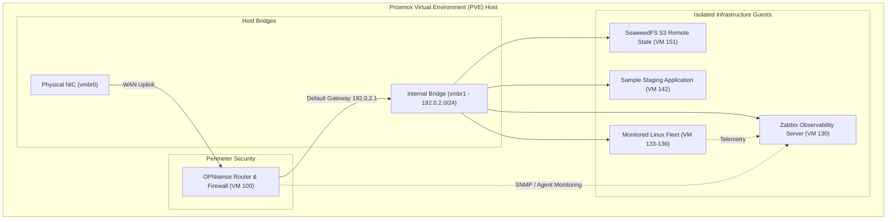
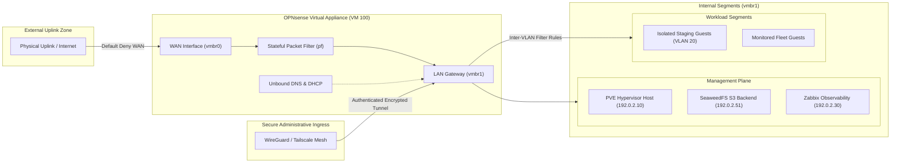

# Private Cloud Platform — Infrastructure as Code & Automation

[](https://github.com/Sureinity/private-cloud-platform-iac/actions/workflows/validate.yml)
[](LICENSE)
[](#security-and-supply-chain)
[](#security-and-supply-chain)
[](#security-and-supply-chain)

Automated private cloud platform featuring declarative Infrastructure as Code (IaC), centralized configuration management, network perimeter security, and continuous supply-chain governance for virtualized Proxmox VE environments.

---

## Platform at a Glance

| Focus Area | Technologies & Tools | Key Practical Implementation |
|---|---|---|
| **Infrastructure as Code** | **Terraform**, Proxmox VE Provider | Parameterized modules for bridges, cloud images, and VMs with decoupled S3 remote state. |
| **Network & Firewall** | **OPNsense**, WireGuard / Tailscale | Declarative firewall rules, inter-VLAN isolation, and Unbound DNS host overrides. |
| **Configuration Management**| **Ansible**, Python | Modular roles for Docker, SSH hardening, user lifecycle, and central UID/GID governance. |
| **Storage & Observability** | **SeaweedFS S3**, **Zabbix** | S3-compatible remote backend storage and distributed Zabbix Agent 2 fleet monitoring. |
| **DevSecOps CI/CD** | **GitHub Actions**, Gitleaks, Checkov, Trivy | Multi-scanner automated validation, CycloneDX SBOM generation, and audited security exceptions. |

---

## Architecture Overview

This platform manages virtualized compute, storage, isolated networking, and application delivery on Proxmox VE (PVE). Hypervisor resources and network firewall policies are orchestrated declaratively with **Terraform**, guest operations are configured with **Ansible**, and system health is tracked with **Zabbix**.



---

## Network Architecture & Perimeter Security

The networking model isolates hypervisor administration and internal guest workloads behind a virtualized perimeter firewall, enforcing zero-trust ingress and micro-segmentation.



### Architectural Principles

1. **Two-Bridge Hypervisor Boundary**:
   - `vmbr0` (WAN): Attached to the physical NIC for upstream connectivity. The Proxmox VE hypervisor has **no management IP assigned on this bridge**, preventing direct scan exposure from the uplink.
   - `vmbr1` (Internal LAN): Isolated virtual bridge with no direct physical uplink. All guest virtual machines and the Proxmox VE web/API management interface (`192.0.2.10:8006`) reside exclusively on this internal bridge.

2. **Perimeter Firewall & Routing (OPNsense)**:
   - Operates as the central default gateway (`192.0.2.1`) and NAT router for all virtualized guests.
   - External WAN operates under a strict default-deny policy for unsolicited inbound connections.
   - Local DNS resolution with Unbound DNS host overrides provides internal service discovery.

3. **Zero-Trust Administrative Ingress**:
   - Hypervisor and appliance management ports are never exposed to the external network.
   - Remote administration traverses an encrypted **WireGuard / Tailscale mesh** terminating on the firewall, providing authenticated point-to-point management access.

4. **Micro-Segmentation & Egress Control**:
   - Application workloads operate on isolated VLANs (e.g., VLAN 20) partitioned from the core infrastructure management segment.
   - Inter-VLAN traffic is inspected via stateful pf packet filtering rules, preventing compromised workloads from pivoting into infrastructure storage or management services.

5. **Declarative Network as Code**:
   - Network policies (firewall aliases, filter rules, DNS host records) are codified and managed declaratively via **Terraform** (`terraform/live/opnsense`).
   - Decoupled from hypervisor provisioning state to prevent circular dependencies during reboots or network reconfigurations.

---

## Core Engineering Highlights

### 1. Declarative Infrastructure as Code (Terraform)
- **Reusable Modules**: Isolated, parameterized modules for Linux bridges (`terraform/modules/bridges`), Proxmox cloud-image provisioning (`terraform/modules/images`), VM definitions (`terraform/modules/proxmox_vm`), and OPNsense firewall configuration (`terraform/modules/opnsense_*`).
- **Decoupled State Management**: Dedicated standalone bootstrap root (`terraform/bootstrap/seaweedfs`) for S3-compatible remote state, with separate live roots for hypervisor guests (`terraform/live/onprem-pve`) and firewall rules (`terraform/live/opnsense`) to eliminate circular dependencies.
- **Multi-Platform Locks**: Deterministic provider lockfiles (`.terraform.lock.hcl`) supporting `linux_amd64`, `linux_arm64`, and `darwin_arm64`.

### 2. Configuration Management & Fleet Operations (Ansible)
- **Modular Roles**: Reusable roles for Docker engine setup, SSH daemon hardening, system user creation, SeaweedFS S3 storage clustering, and Zabbix Agent 2 monitoring fleet rollout.
- **Deterministic UID/GID Allocation**: Central numeric identity registry (`inventory/group_vars/all/uid_registry.yml`) preventing privilege collisions across Linux guests.
- **Dedicated Appliance Operations**: Standalone OPNsense operations project (`ansible/opnsense-ops`) providing automated XML configuration backups and firmware health checks via REST API.

### 3. Supply-Chain Security & Local CI Parity
- **Static Multi-Scanner Pipeline**: Runs `gitleaks` (secret scanning), `trivy` (misconfigurations), `checkov` (policy adherence), `tflint` (Terraform linter), `ansible-lint`, `shellcheck`, and `yamllint`.
- **Security Exception Registry**: Audited, schema-enforced exception catalog (`security/exceptions/`) with mandatory expiration dates and technical rationale.
- **CycloneDX SBOM & Evidence Manifest**: Automated Software Bill of Materials generation (`scripts/ci/generate-sbom.py`) cataloging lockfiles, dependencies, and SHA-256 integrity digests.

---

## Repository Map

```text
.github/workflows/          Static GitHub Actions CI pipelines
ansible/
  infra-ops/                Guest configuration roles (docker, ssh, users, zabbix, seaweedfs)
  opnsense-ops/             OPNsense appliance operational maintenance & backups
docs/                       Diataxis documentation (architecture, how-to guides, reference)
scripts/ci/                 Local CI parity validation scripts and scanners
security/exceptions/        Audited security exception registry
terraform/
  bootstrap/seaweedfs/      Standalone S3 backend VM bootstrap root
  live/
    onprem-pve/             Environment-specific compute & networking composition
    opnsense/               Decoupled declarative OPNsense firewall state
  modules/                  Reusable Terraform modules (bridges, vm, images, opnsense)
tests/ci/                   Unit tests for CI evaluators and schemas
```

---

## Sanitization & Synthetic Data Notice

This repository is a curated public export of an operational on-premises environment. To protect operational security:
- **IP Addressing**: All host addresses, gateways, and subnets use official RFC 5737 (`192.0.2.0/24`, `198.51.100.0/24`, `203.0.113.0/24`) and RFC 3849 (`2001:db8::/32`) test ranges.
- **Domains**: All domain names use the reserved `.example.invalid` pseudo-TLD (RFC 2606 / RFC 6761).
- **Credentials & Keys**: All API tokens, passwords, and SSH keys have been replaced with non-functional dummy placeholders.
- **Workloads**: Application payloads and private client references have been generalized into neutral architectural patterns.

For architectural and security details, see [`docs/explanation/sanitized-architecture-and-security-model.md`](docs/explanation/sanitized-architecture-and-security-model.md).

---

## Local Validation Quickstart

To run the complete static validation suite locally (linting, format, security scans, and SBOM generation):

```bash
# 1. Install prerequisites
pip install -r requirements.txt

# 2. Run master validation suite
./scripts/ci/validate-all.sh
```

---

## License

This project is licensed under the [MIT License](LICENSE).
